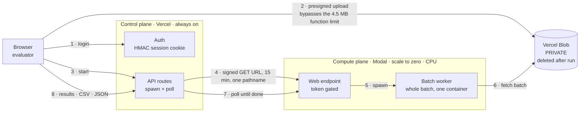
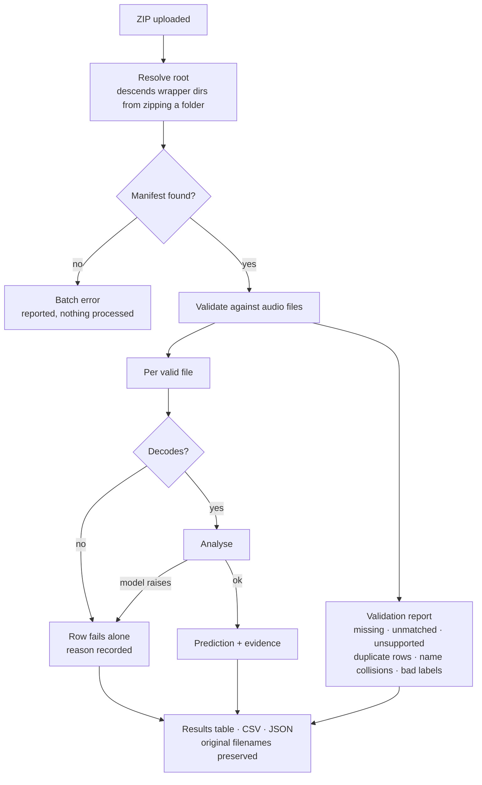
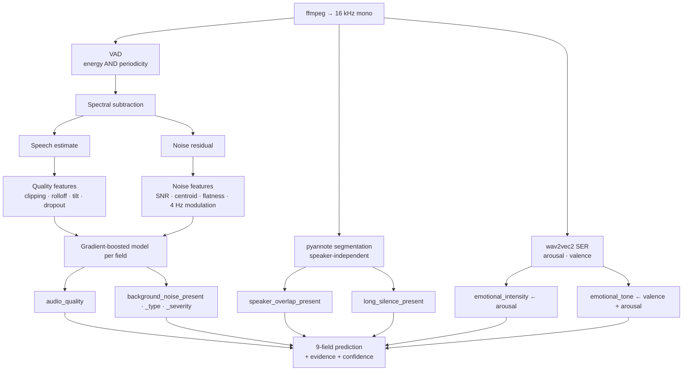

# AutoAce Voice Trial — tone & background-noise analysis

Analyses call audio for background noise, audio quality, speaker overlap and dead
air, and serves it through a hosted dashboard that accepts a batch ZIP.

## Status — read this first

**All nine fields are implemented.** Strength varies by field, and the table
below reports each one honestly against its baseline. `emotional_tone` is the
weakest: the SER model's valence axis orders correctly on RAVDESS (24 actors)
but its absolute scale shifts between studio and phone-codec audio, and 3.96
minutes of labelled audio cannot calibrate a five-class boundary.

Accuracy on the three provided clips: **13/18 field-predictions correct (72%)**.

| field | engine | real-clip | synthetic holdout | baseline |
|---|---|---|---|---|
| `background_noise_type` | GBM over acoustic features | 1/3 | 0.956 | 0.166 |
| `background_noise_severity` | GBM | 1/3 | 0.858 | 0.317 |
| `background_noise_present` | GBM | 2/3 | 0.977 | 0.874 |
| `audio_quality` | GBM | 3/3 | 0.759 | 0.560 |
| `speaker_overlap_present` | pyannote/segmentation-3.0 | 3/3 | — | 0.586 |
| `long_silence_present` | pyannote/segmentation-3.0 | 3/3 | — | 0.517 |
| `emotional_intensity` | SER arousal | **3/3** | RAVDESS AUC 0.770 | — |
| `emotional_tone` | SER valence | 1/3 | RAVDESS AUC 0.747 | — |

Synthetic figures use **root-carrier holdout** — each fold trains without one
entire real recording. Random splits and variant-level splits both leak and
inflate every score; see `STATE.md`. Read every accuracy against its baseline.

## Architecture

Two planes, split by lifecycle. The dashboard is **always on** so a login never
waits for a cold start; compute **scales to zero** so it bills only while a batch
is running. Audio never leaves this infrastructure and reaches no third party.



Why the indirection at step 2: a Vercel function body caps around 4.5 MB and one
provided clip is already 2.8 MB, so the ZIP must go browser-to-blob directly.
The blob is private, so Modal cannot read it unauthenticated — hence the
short-lived signed URL at step 4 rather than a public link.

## Batch workflow

A single malformed file must never fail the batch, so every failure is captured
per file and reported with a reason.



## Per-clip analysis

Two engines, chosen per field by what survives a held-out-speaker test. The
speech/residual split is structural: quality and noise read **different arrays**,
so "do not infer noise from poor audio quality" holds by construction rather than
by a threshold behaving.



pyannote handles overlap and silence because the feature models could not: under
held-out-speaker validation they scored 0.670 and 0.730, and one fold hit 0.485 —
worse than a constant predictor. Three real voices cannot teach speaker
independence; pyannote was trained on thousands.


## Quick start

```bash
uv sync                                   # Python 3.12 is pinned
uv run pytest -q                          # 48 passed, 1 skipped

export HF_TOKEN=hf_...                    # needed for pyannote (gated repo)
uv run python scripts/train_eval.py 900   # trains + writes models/*.joblib
```

Analyse a batch folder (audio + `labels.csv` at its root):

```bash
uv run python -c "
from voicetrial.runner import run_batch
r = run_batch('data/raw'); print(r.to_csv())"
```

## Hosted dashboard

| | |
|---|---|
| URL | see `STATE.md` §6b |
| Login | `admin` / `admin` — **change before sharing** |
| Compute | Modal, scale-to-zero, CPU only |
| Storage | Vercel Blob, **private**; the batch is deleted after the run |

Upload a ZIP (audio at the root plus one CSV manifest with `name` and optional
`result_json`), watch progress, review results, download CSV or JSON.

## How it works

```
ffmpeg → 16 kHz mono
  ├── DSP features (numpy): VAD, spectral subtraction into speech + noise
  │      residual, 20 features → gradient-boosted model per noise/quality field
  └── pyannote/segmentation-3.0 → speaker map → overlap %, longest silence
```

Two design decisions worth knowing:

**Quality is measured on the speech estimate, noise on the residual.** They read
different arrays, so "do not infer background noise from poor audio quality"
holds structurally rather than by a threshold respecting it.

**pyannote handles overlap and silence because the feature models could not.**
Under root-carrier holdout they scored 0.670 and 0.730 — one fold hit 0.485,
worse than a constant predictor — because three real voices cannot teach speaker
independence. pyannote was trained on thousands.

## Cost and latency

Measured, not estimated: **11× realtime** end-to-end with pyannote (21.3 s for
237.8 s of audio), **160× realtime** for the DSP path alone.

At a $0.15/hr CPU instance that is **~$0.0004 per audio-minute — about 13% of the
$0.003 ceiling**, with no GPU anywhere. Tone is unbuilt, so this figure does not
yet include it.

## Reproducing the evaluation

```bash
uv run python scripts/calibrate.py 160    # per-feature separability (AUC)
uv run python scripts/train_eval.py 900   # per-field accuracy + confusion matrix
cd app && node scripts/e2e_check.mjs <batch.zip>   # drives the DEPLOYED system
```

`scripts/train_eval.py` prints a confusion matrix and a majority baseline per
field. Seeds are fixed; runs are reproducible.

## Known limitations

- **Tone is the weakest field.** Bounded by labelled data, not architecture.
- **Confidence is not calibrated** — monotonic and honest in direction, but no
  reliability diagram or ECE exists.
- **3.96 minutes of real audio exists**, and it is both the carrier for the
  synthetic set and the only real test data. Synthetic numbers measure whether
  the detectors work in principle; they do not predict hidden-set accuracy.
- **Label vocabulary differs from the real labels** — the model says
  `office chatter` where `labels.csv` says `TV`, and `static` vs `sharp static`.
- **Two thresholds were set on n=3** (`OVERLAP_FRAME_PCT`, `LONG_SILENCE_S`) and
  are the first things to re-fit given more labelled audio.
- Natural conversational pauses are absent from the synthetic generator, so it
  cannot see silence failures at any sample size.

`STATE.md` carries the full timestamped history, including three evaluation
protocols that were wrong and how each was caught.
